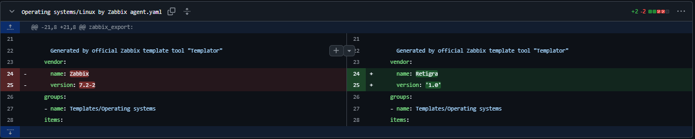

# ZabbixCI Quickstart
For this tutorial, you will need to have a Zabbix server and a remote Git repository set up.
We will be making a backup of your Zabbix templates using ZabbixCI and pushing them to your Git repository.

After your templates are pushed to git, we will make changes to the templates to show how ZabbixCI can sync these changes.

## Prerequisites
You will need the following things setup and working:

* A computer with a working [Python3](https://realpython.com/installing-python/) environment (can be your Zabbix Server!)
* A working [Zabbix server](https://www.zabbix.com/download)
* A [Zabbix API token](https://www.zabbix.com/documentation/7.0/en/manual/web_interface/frontend_sections/users/api_tokens)
* A remote Git repository (e.g. [Github](https://github.com) or [GitLab](https://gitlab.com))
* SSH access to Git ([Github](https://docs.github.com/en/authentication/connecting-to-github-with-ssh) | [Gitlab](https://docs.gitlab.com/ee/user/ssh.html))


## Install ZabbixCI

To install ZabbixCI, use the following command, this will install ZabbixCI and all it's dependencies:

`pip install zabbixci`

> [!IMPORTANT] 
> Some Linux distributions do not allow you to install Python packages directly via pip.
> If this is the case, you can use a Python [virtual environment](https://docs.python.org/3/tutorial/venv.html) to run ZabbixCI. 

If for some reason the installation fails with the following error:
```console
fatal error: git2.h: No such file or directory
```

Please make sure to install any [prerequisites for pygit2](https://www.pygit2.org/install.html) as well.

You should now be able to run zabbixci:
```console
user@localhost:~$ zabbixci --help
usage: zabbixci [-h] [--config CONFIG] [--zabbix-url ZABBIX_URL] [--zabbix-user ZABBIX_USER] [--zabbix-password ZABBIX_PASSWORD] [--zabbix-token ZABBIX_TOKEN] [--remote REMOTE]
                [--pull-branch PULL_BRANCH] [--push-branch PUSH_BRANCH] [--git-username GIT_USERNAME] [--git-password GIT_PASSWORD] [--git-pubkey GIT_PUBKEY] [--git-privkey GIT_PRIVKEY]
                [--git-keypassphrase GIT_KEYPASSPHRASE] [--root-template-group ROOT_TEMPLATE_GROUP] [--template-prefix-path TEMPLATE_PREFIX_PATH]
                [--template-whitelist TEMPLATE_WHITELIST] [--template-blacklist TEMPLATE_BLACKLIST] [--cache CACHE] [--dry-run] [-v] [-vv] [-vvv] [--batch-size BATCH_SIZE]
                [--ignore-template-version] [--insecure-ssl-verify] [--ca-bundle CA_BUNDLE]
                {push,pull,clearcache}

ZabbixCI is a tool to manage Zabbix templates in a Git repository. ZabbixCI adds version control to Zabbix templates, allowing you to track changes, synchronize templates between
different Zabbix servers, and collaborate with other team members.
...truncated...
user@localhost:~$
```

## Configuring ZabbixCI

ZabbixCI can be configured through commandline arguments, environment variables or a configuration file.
In this tutorial we will use a file to configure the needed parameters.

First, create a workingdir for ZabbixCI. This will be used as a local filesystem cache location as well as the location of our configuration:

```console
user@localhost:~$ mkdir zabbixci; cd zabbixci
user@localhost:~/zabbixci$
```

Now, create a `config.yaml` file with your favorite editor with the following contents (replace for your own settings).

> [!TIP] 
> You can download an [example config file](https://raw.githubusercontent.com/retigra/ZabbixCI/refs/heads/main/docs/config.yaml.example) to see all of the allowed options.

```yaml
# Zabbix API connection parameters
zabbix_token: your_Zabbix_API_token
zabbix_url: http://your.zabbix.server

# optional, if you are using untrusted certificates for Zabbix
#ignore_ssl_verify: true

# Primary Template group in Zabbix
root_template_group: Templates

# Git connection parameters
remote: git@github.com:gituser/gitrepo.git
git_pubkey: /path/to/your/ssh_pub.key
git_privkey: /path/to/your/ssh_priv.key

# optional, if you've used a passphrase on your SSH key
#git_keypassphrase: YOURPASSPHRASE
```
> [!TIP] 
> If you've loaded in your ssh key via ssh-agent, you don't need to supply the ssh parameters in the config file.

## Pushing your templates to Git

If everything is configured, we should now be able to perform a dry-run to see if everything is working as expected:

```console
user@localhost:~/zabbixci$ zabbixci push -v --config ./config.yaml --dry-run
2025-01-17 15:51:58,950 [zabbixci.zabbixci]  [INFO]: Found 282 templates in Zabbix
2025-01-17 15:51:58,951 [zabbixci.zabbixci]  [INFO]: Processing batch 1/57
2025-01-17 15:52:00,167 [zabbixci.zabbixci]  [INFO]: Exported Zabbix template MikroTik RB2011iL-IN by SNMP
2025-01-17 15:52:00,499 [zabbixci.zabbixci]  [INFO]: Exported Zabbix template Brocade_Foundry Nonstackable by SNMP
2025-01-17 15:52:00,971 [zabbixci.zabbixci]  [INFO]: Exported Zabbix template MikroTik RB260GSP by SNMP
2025-01-17 15:52:01,245 [zabbixci.zabbixci]  [INFO]: Exported Zabbix template MySQL by Zabbix agent active
2025-01-17 15:52:01,700 [zabbixci.zabbixci]  [INFO]: Exported Zabbix template MikroTik hEX by SNMP
...
2025-01-17 15:54:01,121 [zabbixci.zabbixci]  [INFO]: Remote differs from local state, preparing to push
2025-01-17 15:54:01,134 [zabbixci.zabbixci]  [INFO]: Detected change in Applications/Acronis Cyber Protect Cloud MSP by HTTP.yaml
2025-01-17 15:54:01,300 [zabbixci.zabbixci]  [INFO]: Detected change in Applications/Acronis Cyber Protect Cloud by HTTP.yaml
2025-01-17 15:54:01,312 [zabbixci.zabbixci]  [INFO]: Detected change in Applications/Apache ActiveMQ by JMX.yaml
2025-01-17 15:54:01,404 [zabbixci.zabbixci]  [INFO]: Detected change in Applications/Apache Kafka by JMX.yaml
2025-01-17 15:54:01,537 [zabbixci.zabbixci]  [INFO]: Detected change in Applications/Apache Tomcat by JMX.yaml
...
2025-01-17 15:54:53,360 [zabbixci.zabbixci]  [INFO]: Detected change in Telephony/Asterisk by HTTP.yaml
2025-01-17 15:54:53,472 [zabbixci.zabbixci]  [INFO]: Detected change in Video surveillance/Hikvision camera by HTTP.yaml
2025-01-17 15:54:53,959 [zabbixci.zabbixci]  [INFO]: Dry run enabled, would have committed 282 new changes to git@github.com:gituser/gitrepo.git:main
user@localhost:~/zabbixci$
```

If we don't see any errors, we can run the actual push with:
`zabbixci push -v --config ./config.yaml`

```
...
2025-01-17 16:00:29,719 [zabbixci.zabbixci]  [INFO]: Detected change in Server hardware/SMART by Zabbix agent 2 active.yaml
2025-01-17 16:00:29,809 [zabbixci.zabbixci]  [INFO]: Detected change in Server hardware/SMART by Zabbix agent 2.yaml
2025-01-17 16:00:29,901 [zabbixci.zabbixci]  [INFO]: Detected change in Server hardware/Supermicro Aten by SNMP.yaml
2025-01-17 16:00:29,949 [zabbixci.zabbixci]  [INFO]: Detected change in Telephony/Asterisk by HTTP.yaml
2025-01-17 16:00:30,063 [zabbixci.zabbixci]  [INFO]: Detected change in Video surveillance/Hikvision camera by HTTP.yaml
2025-01-17 16:00:30,327 [zabbixci.zabbixci]  [INFO]: Staged changes from http://your.zabbix.server committed to main
2025-01-17 16:00:34,885 [zabbixci.zabbixci]  [INFO]: Committed 282 new changes to git@github.com:gituser/gitrepo.git:main
user@localhost:~/zabbixci$
```

Now, your templates should show up in your Git repository!


## Make a change in Zabbix

So, now we want to make a change to one of the templates in Zabbix and push this to the development branch in Git.

First, add the following line to the config.yaml file:
```yaml
push_branch: develop
```

> [!TIP] 
> We recommend using a development branch to develop and maintain templates within Git.
> Once the templates have been tested properly, you can merge the changes back to your main branch.
> See ['Branches in a nutshell'](https://git-scm.com/book/en/v2/Git-Branching-Branches-in-a-Nutshell) on working with git Branches.

Now, make a minor change to one of your Templates. In my case I added some text to the `description` field of the
template `HP iLO by SNMP`.

Rerun the command `zabbixci push -v --config ./config.yaml`:

```console
2025-01-17 16:06:55,467 [zabbixci.zabbixci]  [INFO]: Found 282 templates in Zabbix
2025-01-17 16:06:55,468 [zabbixci.zabbixci]  [INFO]: Processing batch 1/57
2025-01-17 16:06:56,644 [zabbixci.zabbixci]  [INFO]: Exported Zabbix template MikroTik RB2011iL-IN by SNMP
2025-01-17 16:06:56,960 [zabbixci.zabbixci]  [INFO]: Exported Zabbix template Brocade_Foundry Nonstackable by SNMP
2025-01-17 16:06:57,410 [zabbixci.zabbixci]  [INFO]: Exported Zabbix template MikroTik RB260GSP by SNMP
...
2025-01-17 16:08:55,070 [zabbixci.zabbixci]  [INFO]: Remote differs from local state, preparing to push
2025-01-17 16:08:55,487 [zabbixci.zabbixci]  [INFO]: Detected change in Server hardware/HP iLO by SNMP.yaml
2025-01-17 16:08:55,879 [zabbixci.zabbixci]  [INFO]: Staged changes from http://your.zabbix.server committed to main
2025-01-17 16:08:57,454 [zabbixci.zabbixci]  [INFO]: Committed 1 new changes to git@github.com:gituser/gitrepo.git:main
user@localhost:~/zabbixci$
```

As you can see, some changes were detected and pushed to the `develop` branch.
You can see the diff in Git:


## Make a change in Git

Now, Let's make a change in Git and import the Change in Zabbix.
In this case we will update the `vendor` and `version` fields in the template "Linux by Zabbix agent":



We can import the change into zabbix using the `zabbixci pull -v --config ./config.yaml` command:

```console
2025-01-17 16:23:30,600 [zabbixci.zabbixci]  [INFO]: Found 282 templates in Zabbix
2025-01-17 16:23:30,600 [zabbixci.zabbixci]  [INFO]: Processing batch 1/57
2025-01-17 16:23:31,840 [zabbixci.zabbixci]  [INFO]: Exported Zabbix template MikroTik RB2011iL-IN by SNMP
2025-01-17 16:23:32,154 [zabbixci.zabbixci]  [INFO]: Exported Zabbix template Brocade_Foundry Nonstackable by SNMP

...
2025-01-17 16:25:32,998 [zabbixci.zabbixci]  [INFO]: Detected local file changes, detecting changes for zabbix sync
2025-01-17 16:25:33,449 [zabbixci.zabbixci]  [INFO]: Detected change in Linux by Zabbix agent
2025-01-17 16:25:33,449 [zabbixci.zabbixci]  [INFO]: Importing Linux by Zabbix agent, level 1
2025-01-17 16:25:35,018 [zabbixci.zabbixci]  [INFO]: Zabbix state has been synchronized, imported 1 templates and deleted 0 templates
user@localhost:~/zabbixci$
```

Zabbix will now have the updated template:


## Conclusion

Congratulations, in this tutorial you've learned the basic workings of ZabbixCI!
Please refer to the [docs](https://github.com/retigra/ZabbixCI/tree/main/docs) for further information.
